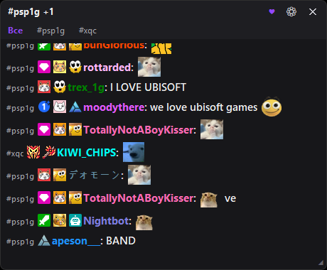
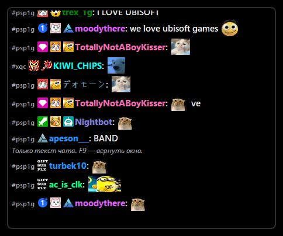
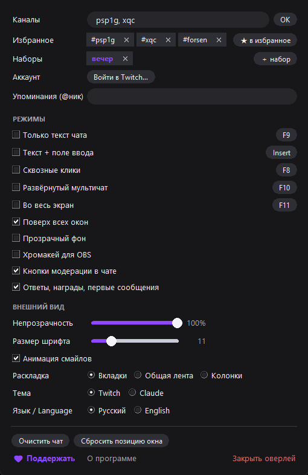

# Twitch Chat Overlay

**Чат Twitch поверх любых окон и игр · Twitch chat on top of any window or game**

*by [aliveenjoyer](https://twitch.tv/aliveenjoyer)*

| Только текст (F9) | Настройки |
|:---:|:---:|
|  |  |

> **English:** lightweight always-on-top Twitch chat overlay for Windows.
> Multi-channel with tabs, real badges, Twitch + 7TV emotes, mention
> highlights, sending messages after OAuth login, text-only ghost mode (F9),
> click-through (F8), Twitch/Claude themes, RU/EN interface. Grab
> `TwitchChatOverlay.exe` from [Releases](../../releases) — no install needed;
> switch the interface to English in settings.

---

Показывает чат любого канала Twitch в компактном окне **поверх всех остальных окон**
(игры, браузер, плеер и т.д.). Логин в Twitch не нужен — чат читается анонимно.

Сторонних библиотек нет. Единственное требование — Python, и его **батник
устанавливает сам**, если на компьютере его нет (см. «Запуск»).
Либо возьмите готовый `TwitchChatOverlay.exe` из [релизов](../../releases) —
ему не нужно вообще ничего.

## Запуск

**Первый раз (или на новом компьютере):** двойной клик по **`Запустить оверлей.bat`**.
Батник сам найдёт Python, а если его нет — скачает официальный установщик
с python.org (~26 МБ) и тихо установит (без прав администратора), после чего
запустит оверлей. Нужен только интернет.

Дальше можно запускать как удобно: тем же батником, двойным кликом по
`twitch_chat_overlay.pyw` или ярлыком «Twitch чат» на рабочем столе.
Повторный запуск вторую копию не открывает — работает всегда один оверлей.

При первом запуске программа спросит название канала — введите имя
(например `mokrivskyi`) или просто вставьте ссылку на канал. Канал запоминается.

**Версия .exe:** `TwitchChatOverlay.exe` — то же самое, но вообще без Python:
один файл, запускается двойным кликом на любом Windows. При первом запуске
SmartScreen может предупредить о неизвестном издателе — «Подробнее» →
«Выполнить в любом случае».

## Управление

| Действие | Как |
|---|---|
| Переместить окно | перетащить за верхнюю тёмную полосу |
| Изменить размер | потянуть за уголок `◢` справа внизу |
| Меню настроек | правый клик по окну или кнопка `⚙` |
| Каналы (можно несколько!) | меню → «Каналы…», через запятую: `канал1, канал2` |
| Написать в чат | меню → «Войти в Twitch…», внизу появится поле ввода |
| Сквозные клики (мышь проходит сквозь окно) | **F8** или меню |
| Только текст чата (без рамки, полосы и фона) | **F9** или меню |
| Развернуть в большой мультичат (колонки) и обратно | **F10** или настройки |
| Во весь экран текущего монитора и обратно | **F11** или настройки |
| Свернуть в панель задач | кнопка `—` в шапке |
| Пикер смайлов (Twitch + 7TV, с поиском и недавними) | кнопка 🙂 у поля ввода |
| Переназначить клавиши F8/F9 | меню → «Настройки» → «Горячие клавиши» |
| Открыть профиль зрителя | клик по нику или @упоминанию в чате |
| Сменить тему (Twitch / Claude) | меню → «Внешний вид» → «Тема» |
| Язык интерфейса (рус/eng) | меню → «Настройки» → «Язык / Language» |
| Закрыть | кнопка `✕` или меню → «Закрыть оверлей» |

## Несколько каналов

В настройках перечислите каналы через запятую. Появятся **вкладки**:
«Все» — общий поток всех чатов с метками `#канал`, плюс отдельная вкладка
на каждый канал. Выбранная вкладка запоминается. На вкладке канала
сообщения отправляются именно в него; в режиме «Все» канал для отправки
переключается кнопкой `#канал ▾` слева от поля ввода.

На неактивных вкладках показываются **счётчики**: `·N` — сколько новых
сообщений, `✱N` (красным) — сколько упоминаний вас и ответов на ваши
сообщения. Открыли вкладку — счётчик обнулился.

**Избранное и наборы** (в настройках): часто смотрите одни и те же каналы —
добавьте их в избранное кнопкой «★ в избранное» и подставляйте кликом. Набор
каналов можно сохранить под именем («вечер», «турниры», «друзья») кнопкой
«＋ набор» и потом подключать все разом одним кликом.

**Раскладка** (настройки → «Раскладка») — три режима:
- **Вкладки** — переключаемые вкладки каналов (по умолчанию).
- **Общая лента** — все каналы одним потоком без вкладок.
- **Колонки** — до 4 каналов бок о бок одновременно; клик по заголовку
  колонки выбирает, в какой канал уходит сообщение.

## Вход в Twitch и отправка сообщений

Меню → «Войти в Twitch…» → кнопка «Получить токен» откроет сайт
twitchtokengenerator.com: выберите **Bot Chat Token**, войдите в Twitch,
скопируйте **ACCESS TOKEN** и вставьте в окно входа. После этого внизу
оверлея появится поле — пишите и жмите Enter.

Токен хранится только на вашем компьютере в зашифрованном виде (Windows DPAPI:
расшифровать может только ваш пользователь Windows) и никуда, кроме серверов
Twitch, не отправляется. Выйти: меню → «Выйти».

## OBS и стриминг

Как показать чат зрителям:

- **Захват экрана** — работает сразу: зрители видят то же, что и вы
  (прозрачность сохраняется).
- **Захват окна** (обычный случай) — Windows отдаёт OBS «сырое» окно, поэтому
  прозрачный фон в захвате получается непрозрачным. Решение: в настройках
  оверлея включите **«Хромакей для OBS»** — фон захвата станет чисто-пурпурным
  (на вашем экране ничего не изменится). Затем в OBS: правый клик по источнику →
  **«Фильтры» → «+» → «Цветовой ключ»**, тип ключа — пурпурный. Готово,
  у зрителей чат прозрачный.
- **Захват игры** оверлей не видит вовсе — добавляйте чат отдельным источником
  «Захват окна».

## Модерация

Если вы модератор канала (или это ваш канал) и вошли в аккаунт, перед каждым
сообщением появляется ряд кнопок модерации, как в мод-виде Twitch:

- ⊘ — **бан** (нажмите дважды в течение 3 секунд, чтобы не забанить случайно)
- ◷ — **таймаут** на 10 минут
- ⚠ — **предупреждение**
- 🗑 — **удалить сообщение**

Плюс **правый клик по нику** открывает ту же карточку действий с профилем.
Кнопки видны только там, где у вас есть модерка. Ряд иконок можно отключить
в настройках («Кнопки модерации в чате»), карточка по правому клику останется.

**Анонсы:** если вы модератор или стример, слева от поля ввода появляется
кнопка-мегафон — она отправляет набранный текст цветным объявлением
(`/announce`) вместо обычного сообщения.

Важно: токену нужны модерские права. На twitchtokengenerator.com при выпуске
токена отметьте дополнительно `moderator:manage:banned_users`,
`moderator:manage:chat_messages` и `moderator:manage:warnings`
(если токен уже был — просто перелогиньтесь с новым токеном).

## Упоминания

Когда в чате пишут ваш ник (с @ или без) — сообщение подсвечивается
фиолетовым, а верхняя полоса окна мигает. Ник берётся из авторизации
автоматически; без входа его можно задать вручную: меню → «Упоминания…».

## Настройки (правый клик)

- **Внешний вид** — непрозрачность 50–100%, размер шрифта 9–18, тема
  (Twitch/Claude), прозрачный фон.
- Если пролистать чат вверх, внизу появляется кнопка «↓ новые сообщения» —
  клик возвращает к свежим.
- **Сквозные клики (F8)** — окно перестаёт ловить мышь: можно кликать по тому,
  что под ним. Удобно во время игры. Нажмите F8 ещё раз, чтобы вернуть управление.
- Позиция, размер и все настройки сохраняются в `overlay_config.json`.

## Что умеет

- Цвета ников как на Twitch, значки — настоящие картинки как в чате
  (модератор, VIP, сабские значки каждого подключённого канала).
- Смайлики Twitch показываются картинками (кэш в папках `.emote_cache` и `.badge_cache`).
- **Смайлы 7TV** — глобальные и канальные (анимированные показываются первым
  кадром). Работают **без VPN даже там, где 7TV заблокирован провайдером**
  (актуально для РФ): при недоступности прямых доменов оверлей автоматически
  переключается на зеркала, а карты смайлов кэшируются на диск.
- Шрифт в духе Twitch: полужирный текст сообщений, жирные ники (если установить
  шрифт Inter или Roobert — программа подхватит его автоматически).
- Несколько каналов одной лентой, отправка сообщений после входа,
  подсветка упоминаний.
- Уведомления о сабах/рейдах.
- Автопереподключение при обрыве связи.
- Если прокрутить чат вверх — автопрокрутка ставится на паузу, вниз — снова едет сама.

## Автозапуск вместе с Windows (по желанию)

Нажмите `Win + R`, введите `shell:startup`, нажмите Enter — откроется папка.
Скопируйте туда ярлык «Twitch чат» с рабочего стола.

## Ограничение

Поверх игр в **полноэкранном (эксклюзивном)** режиме оверлей не виден — так
устроен Windows. В настройках игры выберите режим **«оконный без рамки»
(borderless / windowed fullscreen)** — тогда чат будет поверх игры.
